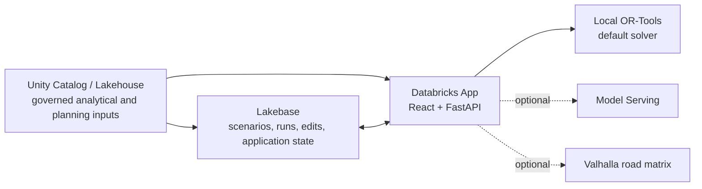

# Architecture and data contracts



Unity Catalog holds the source and planning tables. Lakebase holds mutable application state and durable run records. The App joins those concerns at the API boundary. Optimization services sit behind solver and matrix provider interfaces, so a workshop can run locally and a deployment can opt into remote compute.

Network inputs distinguish `facility_supply_daily` (fresh daily DC stock) from `facility_capacity_daily` (DC/depot handling throughput). The network solver constrains both independently. AIR transfers move conserved stock through dated inventory nodes and the same handling gates used by normal shipments. Direct alternate linehaul and customer reassignment can bypass a constrained facility. Solved snapshots retain normal/effective input provenance; accepting a flow preserves its supply, handling, and transfer settings for the map and subsequent scenarios.

## Main contracts

| Producer | Consumer | Contract | Change guidance |
| --- | --- | --- | --- |
| Synthetic generator or customer ingestion | Lakehouse pipeline | Depots, customers, fleet, orders, dates, and stable IDs | Keep IDs stable within a snapshot; validate units, coordinates, and relationships before planning. |
| Canonical network tables | Network planning service | Facilities, lanes, demand, capacity, and dated rates | Preserve keys and effective dates; a partial bootstrap is rejected. |
| FastAPI | React | JSON routes under `/api`; request and response shapes in `src/api/types.ts` | Update both sides together; retain loading, empty, and error handling. |
| Lakebase migrations | FastAPI services | App-owned schema with scenario definitions, snapshots, jobs, results, and audit state | Apply idempotent migrations; retain saved run IDs and historical results. |
| Matrix provider | Depot solver | Ordered origin/destination travel times and distances | Preserve point order, units, and unreachable-arc signaling. |
| Solver | Run persistence | Feasible routes, costs, constraint diagnostics, and provenance | Record solver and matrix mode for every run. |

```mermaid
sequenceDiagram
  participant User
  participant UI as React
  participant API as FastAPI
  participant UC as Lakehouse
  participant LB as Lakebase
  participant OPT as Solver / matrix
  User->>UI: Inspect network and create scenario
  UI->>API: Save scenario
  API->>LB: Persist scenario revision
  User->>UI: Solve
  UI->>API: Start run
  API->>UC: Read governed planning inputs
  API->>OPT: Build matrix and optimize
  API->>LB: Persist result and provenance
  UI->>API: Compare and accept decision
  API->>LB: Persist accepted baseline pointer
```

The in-process queues provide responsive demos and local development. They are not a production job scheduler; use Lakeflow Jobs for durable, separately operated production workloads.
